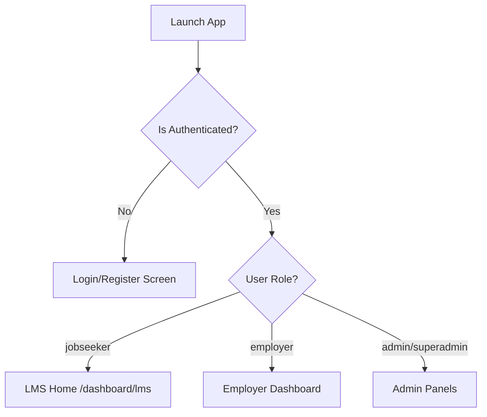

# Product Requirement Document (PRD)
## Job Portal & LMS System: Porting Web to React Native (Android)

---

## 1. Executive Summary & Migration Goal
This document outlines the Product Requirements, page flows, and working logic of the **Job Portal & Learning Management System (LMS)**. The goal is to build an identical, high-performance **React Native Android Application** that retains 100% parity with the features, database logic, and user journeys of the existing React web application.

### Tech Stack Translation
*   **Web App**: React (SPA), React Router, TailwindCSS, Firebase Auth, Firestore, Firebase Cloud Functions, Razorpay Web Checkout, FCM Web SDK, WhatsApp Webhook Integration.
*   **Target Mobile App**: React Native (Expo or CLI), React Navigation, TailwindCSS via NativeWind (optional) or Custom Stylesheets, Firebase SDK, Razorpay Mobile SDK (`react-native-razorpay`), FCM Push Notifications, and WebView (for document previewing).

---

## 2. Core Architecture & Navigation Flow
The application dynamically adjusts navigation views and routes based on the authenticated user's role (`userData.userType`) stored in the Firestore `users` collection.



### Global Bottom Navigation (Tabs)
For a mobile app, this translates to a **Bottom Tab Navigator** using `@react-navigation/bottom-tabs`.

#### Job Seeker Navigation
1.  **LMS Home (Default Landing)**: Main learning dashboard, statistics, enrolled courses, current affairs, and PDF resources.
2.  **Browse Jobs**: Filterable job catalog, keyword searches, and job details.
3.  **Saved Jobs**: Bookmarked jobs list.
4.  **Applications**: History of jobs applied for and current status.
5.  **Profile**: Resume fields, qualifications, and personal information.

#### Employer (Recruiter) Navigation
1.  **Home Dashboard**: Analytics dashboard, subscription stats, and recent application activity.
2.  **Post Job**: 4-step wizard to create and publish job listings.
3.  **Applications**: A global pipeline to review all job applications.
4.  **Manage Jobs**: Lists active/inactive listings with editing and deleting tools.
5.  **Company Profile**: Configuration of company logo, name, website, and info.

---

## 3. Shared Modules (Authentication & Registration)

### 3.1. Login Screen
*   **Fields**: Email (string), Password (string).
*   **Logic**: Standard Firebase Authentication email/password login.
*   **Redirection**: Fetches user profile from Firestore `users/{uid}`. Redirects to `/dashboard/lms` for jobseekers or `/dashboard/employer` for employers.

### 3.2. Registration Screen
*   **Fields**:
    *   First Name (minimum 2 chars)
    *   Last Name (minimum 2 chars)
    *   Email (valid format)
    *   Phone Number (10-digit number)
    *   Password (minimum 6 chars, containing 1 uppercase, 1 lowercase, 1 number)
    *   User Type (Job Seeker / Employer / Agent)
    *   Referral Code (Optional - passed in via query parameters for Franchise tracking)
*   **Working Logic**:
    1.  Registers user in Firebase Authentication.
    2.  Creates a user document in Firestore `users/{uid}`.
    3.  If a referral code is provided:
        *   Checks if it belongs to a franchise (via `franchises/{referralCode}`). If yes, writes `franchiseId` to the user profile.
        *   Otherwise, verifies if it belongs to an agent.

---

## 4. Job Seeker Module: Feature & Logic Deep-Dive

### 4.1. LMS Dashboard (`LmsDashboard.jsx`)
Features a tabbed learning ecosystem. The mobile equivalent should use a custom scrollable header or sliding tabs.

#### A. Explore Tab (Courses Catalog)
*   **Features**:
    *   Carousel of featured courses.
    *   Filtering by category, price (All/Free/Paid), and duration (Short/Medium/Long).
    *   Search field with immediate list filtering.
    *   Bookmarking trigger (saves locally in AsyncStorage or syncs to user document).
*   **Redirection**: Clicking a course opens `CourseView` screen.

#### B. Daily Current Affairs Tab
*   **Features**:
    *   Displays daily educational/general news articles fetched from Firestore.
    *   Supports bookmarking articles (saves to Firestore `user_bookmarks` or updates a list inside the user document).
    *   "Share" action (uses React Native's `Share` API to share URLs).

#### C. Study Resources Tab
*   **Features**:
    *   A repository of downloadable PDF guides, exam brochures, or notes.
    *   **PDF Download Logic**: Tracks download count in Firestore `resources/{docId}`. Opens the PDF using external browser links or inline WebViews.

#### D. My Learning Tab
*   **Features**:
    *   Lists courses that the user has enrolled in.
    *   Displays progress bars showing the percentage completed (calculated by completed lessons / total lessons).

---

### 4.2. Course Player & Syllabus View (`CourseView.jsx`)
Displays a video player at the top and an accordion-style curriculum tree below.

```
+------------------------------------------+
|            Video Player (Vimeo)          |
|  [||] 02:45 / 15:00                      |
+------------------------------------------+
| Course: React Native Masterclass   [18%] |
+------------------------------------------+
| Module 1: Getting Started            [v] |
|   - 1. Setup Environment  (80% Done) [>] |
|   - 2. Hello World        (0% Done)  [L] |
| Module 2: Practice Exam              [^] |
|   - [Mock Test] React Hooks Exam     [ ] |
+------------------------------------------+
```

#### A. Video Player & Progress Tracking Logic
*   **Vimeo Integration**: Video playback uses Vimeo embeds. The web app extracts the ID from Vimeo URLs (e.g. `https://vimeo.com/76979871` -> `76979871`) and plays them in an iframe. For React Native, use `react-native-webview` or Vimeo Player API wrapper.
*   **Simulated Watch Timer (Crucial)**:
    1.  Upon opening a lesson, fetches current watch progress from `user_progress/{userId_courseId_lessonId}`.
    2.  Sets up an interval timer ticking every second:
        *   Ticks up elapsed seconds.
        *   Updates the local state progress bar in real-time.
        *   **Premium Preview Lock**: If the user is *not* enrolled in the course and the lesson is *not* marked as free, limits preview playback to **5 minutes (300 seconds)**. Once reached, stops playback and displays an "Enroll Now" lock screen.
        *   **Completion Milestone**: When watch position reaches **80% or more** of the total video duration, registers the lesson as *Completed*.
    3.  Every **10 seconds**, sends watch position saves to Firestore using `updateVideoProgress()`.

#### B. Document Viewer
*   If the lesson content is a PDF, displays direct links:
    *   Non-enrolled users are blocked from downloading.
    *   Enrolled users can view PDFs inside the application or download them locally.

#### C. Practice Mock Tests
*   Associated mock tests are displayed inside the curriculum tree under an accordion section titled "Test" or "Final Course Examination".
*   If the user has not completed 100% of the course syllabus, the test button shows a lock icon (can be configured to warn or lock access).

---

### 4.3. Exam Attempt Portal (`TestAttempt.jsx`)
Full-screen exam interface. Once started, standard navigation tabs must be hidden.

#### Quiz Features & Execution Logic:
1.  **Timer Countdown**: Converts `timeLimit` (minutes) to seconds. Ticks down every second. Auto-submits the quiz if the timer hits `00:00`.
2.  **Navigation Palette**: Displays a grid of question numbers. Colors vary based on status:
    *   *Grey*: Unvisited
    *   *Yellow*: Visited but unanswered
    *   *Blue*: Answered
    *   *Orange/Flagged*: Starred for review
3.  **Answering MCQs**: Selecting radio buttons maps option index `0-3` to `selectedAnswers[questionId]`.
4.  **Auto Scroll Control**: Screen locks scrolling on the main page to focus entirely on the exam cards.
5.  **Score Calculation**:
    *   Correct answers count +1.
    *   Incorrect answers count negative marks if `negativeMarking` is set (e.g., `-0.25`).
    *   `accuracy` = `correct / (correct + wrong) * 100`.
    *   `scorePct` = `(score / totalQuestions) * 100`.
    *   `isPassed` = `scorePct >= passingRatio` (default threshold is 80%).

#### Certificate Generation Logic:
*   On passing the test, calls `generateCertificate(userId, courseId, studentName, courseTitle)`.
*   Generates a unique `certificateNumber` and adds a record in the `certificates` collection.
*   Shows a "Download Certificate" screen referencing `/certificates/{certificateId}` containing a sharing link to LinkedIn.

---

### 4.4. Job Portal Seeker Actions

#### A. Browse Jobs & Apply
*   **Search**: Searches against lowercase array strings `searchKeywords` inside Firestore `jobs` collection.
*   **Apply Dialog**: Opens a bottom sheet/modal:
    *   Fetches the seeker's profile to pre-fill name, email, phone, location, and resume URL.
    *   Asks for a custom Cover Letter.
    *   Applies a subscription check: Checks `subscriptions` collection for user's active status. Checks if `usageStats.applicationsUsed < maxApplications`. If limits are exceeded, blocks application.
    *   Increments `usageStats.applicationsUsed` in Firestore upon successful submission.
    *   Sends FCM alert to the employer: `"[Name] applied for [Job Title]"`.

#### B. Profile Completeness Indicator
*   Evaluates a progress score from 0% to 100% based on populated fields:
    *   *PersonalInfo*: 25% (Name, email, phone, location, address)
    *   *Education*: 20% (requires at least 1 entry)
    *   *Experience*: 20% (requires at least 1 entry)
    *   *Skills*: 15% (requires at least 3 skills)
    *   *Resume*: 20% (requires uploaded file URL)
*   If completeness is `< 85%`, the dashboard displays a warning banner to prompt details completion.

---

## 5. Recruiter & Employer Module: Feature & Logic Deep-Dive

### 5.1. Employer Dashboard (`EmployerDashboard.jsx`)
The core pipeline hub showing company analytics and recruiter actions.

*   **Hiring Analytics**: Displays counter blocks for:
    *   Active posted jobs count.
    *   Total applications received.
    *   Shortlisted applications count.
    *   Average response rate (Calculated as: `(totalApplications - pendingApplications) / totalApplications * 100`).
*   **Recent Activity Stream**: A sorted feed of recent events:
    *   "Candidate X applied for Job Y."
    *   "Candidate Z shortlisted for Job W."
    *   "Job A posted successfully."
*   **Subscription Details Card**: Displays remaining job posting credits, featured post counts, and active plan expiration date.

---

### 5.2. 4-Step Job Posting Wizard (`PostJob.jsx`)
Prevents user errors by dividing complex forms into intuitive steps.

```
Step 1: Details  ==>  Step 2: Location & Pay  ==>  Step 3: Skills & Specs  ==>  Step 4: AI & Settings
```

*   **Field Validation Rules**:
    *   *Step 1*: Job Title, Industry type, Job Type (Full-time, Part-time, Contract, Internship), Work Mode (Office, Remote, Hybrid), Required Experience (number of years), and Gender Preference must be filled.
    *   *Step 2*: City, State, Country, Salary range (Min, Max, negotiable checkbox, monthly/yearly period) must be populated.
    *   *Step 3*: Required Skills (Chip collection array), Preferred Skills, Education requirement, and Benefits list.
    *   *Step 4*: Job Description (Rich-text description), Responsibilities, Application Instructions, Deadline Date, status, and urgency flags.
*   **Post Limits Verification**:
    *   Prior to publishing, queries Firestore subscription status:
        *   If `usageStats.jobPostingsUsed >= maxJobPostings`, checks if user has other credits or blocks posting.
        *   Increments `jobPostingsUsed` in user's active subscription on success.
    *   Updates `jobs` collection. Creates search keywords using split arrays for optimized indexing.
    *   Sends a WhatsApp message alert via a webhook script notifying admin/jobseekers of a new listing.

---

### 5.3. Job Applications & Pipeline Management
Recruiters can access applications globally or filtered per job listing.

*   **Application Pipeline Stages**:
    `Pending ➔ Reviewing ➔ Shortlisted ➔ Interviewed ➔ Rejected ➔ Hired`
*   **Working Logic**:
    *   Selecting a candidate displays a profile preview drawer containing their CV, summary, skills, education, and experience details.
    *   Changing a candidate's pipeline status updates the status field inside `applications/{appId}`.
    *   Triggers FCM notification to the jobseeker: `"Your application status for [Job Title] was updated to [Status]"`.

---

### 5.4. Candidate Search Database (`SeekerDatabase.jsx`)
Allows recruiters to proactively scan the talent pool.

*   **Search Filters**: Filter by State, District, Taluka, Skills list, Experience years, and languages.
*   **Subscription Control**:
    *   Employers can see general profile snapshots.
    *   Accessing detailed personal details (e.g. phone number, email) or downloading CV files increments the `usageStats.resumeDownloads` field in the recruiter's subscription.
    *   Limits views if quota is exhausted.

---

## 6. Certificate Design & Verification System (Same-To-Same Layout)

To ensure the mobile app matches the web rendering exactly, the React Native application must replicate the custom certificate styles and generation patterns.

### 6.1. Visual Specification Checklist
1.  **Aspect Ratio**: Styled in landscape mode at standard A4 landscape proportions (`1.414 : 1`).
2.  **Gold Double Border**: Replicated using dual borders:
    *   Outer border: Solid fine line.
    *   Inner border: Thick, double-lined gold border (`border-[10px] border-double border-amber-500/25`).
3.  **Fonts**: Primary serif body font (e.g., `Georgia, serif`) to mimic a traditional paper diploma.
4.  **Academy Watermark**: Center background text in large, light font style (`opacity-[0.025]`, 50-70px height) reading the Academy's Name in all-caps.
5.  **Seal and Stamp Details**:
    *   *Top-Right corner*: Circular dashed "OFFICIAL SEAL" border, rotated by 12 degrees.
    *   *Bottom-Center/Right*: Round gold gradient seal (`from-amber-400 via-yellow-300 to-amber-600`) with high-contrast text stating `VERIFIED EXCELLENCE` and two gold ribbon-shaped blocks dropping below.
6.  **Signature Alignment**:
    *   *Left*: Date of Issue.
    *   *Right*: Course Director signature line with the Academy's name in italic script.
7.  **Center Credentials**:
    *   Upper subtitle: "Certificate of Excellence" tracking `letter-spacing: 0.25em`.
    *   Candidate Name: Bold, uppercase letters with a thin amber line underneath.
    *   Course Title: Bold, distinct indigo text style (`#4338ca` / `text-indigo-700`).

---

### 6.2. Mobile Implementation Blueprint (React Native HTML-to-PDF)
The most reliable method to achieve pixel-perfect styling match is rendering the HTML/CSS template directly into a PDF using `@expo-print` (Expo) or `react-native-html-to-pdf` (CLI) and sharing/printing the file path.

#### Same-to-Same HTML Template Code
```javascript
const generateCertificateHtml = (certificate) => `
<!DOCTYPE html>
<html>
<head>
  <style>
    body {
      margin: 0;
      padding: 0;
      background-color: #ffffff;
      display: flex;
      justify-content: center;
      align-items: center;
      height: 100vh;
    }
    .cert-container {
      width: 297mm;
      height: 210mm;
      box-sizing: border-box;
      border: 15px double rgba(245, 158, 11, 0.25);
      padding: 40px 60px;
      position: relative;
      background: #ffffff;
      display: flex;
      flex-direction: column;
      justify-content: space-between;
      text-align: center;
      font-family: 'Georgia', serif;
    }
    .watermark {
      position: absolute;
      top: 50%;
      left: 50%;
      transform: translate(-50%, -50%);
      font-size: 70px;
      color: rgba(0, 0, 0, 0.025);
      font-weight: bold;
      letter-spacing: 10px;
      pointer-events: none;
      white-space: nowrap;
      text-transform: uppercase;
      z-index: 1;
    }
    .top-seal {
      position: absolute;
      top: 30px;
      right: 40px;
      width: 80px;
      height: 80px;
      border: 1px dashed rgba(245, 158, 11, 0.2);
      border-radius: 50%;
      display: flex;
      align-items: center;
      justify-content: center;
      color: rgba(245, 158, 11, 0.15);
      font-size: 8px;
      font-weight: 900;
      transform: rotate(12deg);
      text-transform: uppercase;
    }
    .header-section {
      z-index: 2;
    }
    .subtitle {
      font-size: 11px;
      letter-spacing: 0.25em;
      font-family: sans-serif;
      font-weight: 900;
      color: #b45309;
      text-transform: uppercase;
    }
    .academy-name {
      font-size: 26px;
      font-style: italic;
      font-weight: 900;
      color: #1e293b;
      margin: 10px 0;
    }
    .body-section {
      z-index: 2;
    }
    .presented-text {
      font-size: 12px;
      color: #94a3b8;
      font-style: italic;
      font-family: sans-serif;
    }
    .student-name {
      font-size: 28px;
      font-weight: bold;
      color: #0f172a;
      border-bottom: 1px solid rgba(245, 158, 11, 0.2);
      padding-bottom: 5px;
      display: inline-block;
      width: 80%;
      margin: 10px auto;
      text-transform: uppercase;
      letter-spacing: 1px;
    }
    .course-details {
      font-size: 11px;
      color: #64748b;
      max-width: 500px;
      margin: 10px auto;
      line-height: 1.6;
      font-family: sans-serif;
    }
    .course-name {
      font-size: 20px;
      font-weight: 900;
      color: #4338ca;
      margin-top: 5px;
    }
    .footer-section {
      display: flex;
      justify-content: space-between;
      align-items: flex-end;
      z-index: 2;
      font-family: sans-serif;
      padding-top: 20px;
    }
    .footer-col {
      width: 30%;
    }
    .label {
      font-size: 9px;
      color: #94a3b8;
      text-transform: uppercase;
      font-weight: bold;
      letter-spacing: 1px;
    }
    .value {
      font-size: 11px;
      color: #1e293b;
      font-weight: bold;
      margin-top: 5px;
    }
    .sig-line {
      font-family: 'Georgia', serif;
      font-style: italic;
      border-bottom: 1px solid #cbd5e1;
      padding-bottom: 2px;
      display: inline-block;
      width: 80%;
    }
    .stamp-container {
      position: relative;
      width: 70px;
      height: 70px;
      display: flex;
      align-items: center;
      justify-content: center;
    }
    .gold-seal {
      position: absolute;
      width: 100%;
      height: 100%;
      background: linear-gradient(135deg, #fbbf24, #f59e0b, #d97706);
      border-radius: 50%;
      border: 1px solid #fbbf24;
      box-shadow: 0 4px 6px -1px rgba(0, 0, 0, 0.1);
      z-index: 3;
    }
    .inner-seal {
      position: absolute;
      width: 80%;
      height: 80%;
      border-radius: 50%;
      border: 1px solid #fef3c7;
      display: flex;
      flex-direction: column;
      align-items: center;
      justify-content: center;
      color: #ffffff;
      font-size: 8px;
      font-weight: 900;
      text-transform: uppercase;
      letter-spacing: -0.5px;
      z-index: 4;
      text-align: center;
    }
    .ribbon-l {
      position: absolute;
      bottom: -15px;
      left: 15px;
      width: 15px;
      height: 35px;
      background-color: #d97706;
      transform: rotate(15deg);
      clip-path: polygon(0% 0%, 100% 0%, 100% 100%, 50% 80%, 0% 100%);
      z-index: 2;
    }
    .ribbon-r {
      position: absolute;
      bottom: -15px;
      right: 15px;
      width: 15px;
      height: 35px;
      background-color: #d97706;
      transform: rotate(-15deg);
      clip-path: polygon(0% 0%, 100% 0%, 100% 100%, 50% 80%, 0% 100%);
      z-index: 2;
    }
  </style>
</head>
<body>
  <div class="cert-container">
    <div class="watermark">${certificate.academyName || 'iCoded Academy'}</div>
    <div class="top-seal">Official Seal</div>
    
    <div class="header-section">
      <span class="subtitle">Certificate of Excellence</span>
      <h1 class="academy-name">${certificate.academyName || 'iCoded Academy'}</h1>
    </div>
    
    <div class="body-section">
      <p class="presented-text">This credential is proudly presented to</p>
      <div class="student-name">${certificate.studentName}</div>
      <p class="course-details">
        for demonstrating technical mastery and successfully passing all lesson modules and the final assessment examination for the professional curriculum
      </p>
      <div class="course-name">${certificate.courseName}</div>
    </div>
    
    <div class="footer-section">
      <div class="footer-col" style="text-align: left;">
        <span class="label">Date of Issue</span>
        <div class="value">${certificate.issuedDate}</div>
      </div>
      
      <div class="stamp-container">
        <div class="gold-seal"></div>
        <div class="inner-seal">
          <span>Verified</span>
          <span style="font-size: 6px; opacity: 0.8; margin-top: 1px;">Excellence</span>
        </div>
        <div class="ribbon-l"></div>
        <div class="ribbon-r"></div>
      </div>
      
      <div class="footer-col" style="text-align: right;">
        <span class="label">Course Director</span>
        <div class="value">
          <span class="sig-line">${certificate.academyName || 'iCoded Academy'}</span>
        </div>
      </div>
    </div>
  </div>
</body>
</html>
`;
```

---

## 7. Firestore Database & Collection Schema

Porting to React Native requires the exact same Firestore collection keys and structures to maintain compatibility.

### 6.1. `users` Collection
```json
users/{uid} = {
  "firstName": "Rahul",
  "lastName": "Sharma",
  "email": "rahul@email.com",
  "phone": "9876543210",
  "userType": "jobseeker", // "jobseeker" | "employer" | "agent" | "superadmin"
  "location": "Pune, Maharashtra",
  "state": "Maharashtra",
  "district": "Pune",
  "taluka": "Haveli",
  "createdAt": "timestamp",
  "updatedAt": "timestamp",
  "referredBy": "agent_or_franchise_uid",
  "franchiseId": "franchise_uid" // Optional
}
```

### 6.2. `jobs` Collection
```json
jobs/{jobId} = {
  "title": "React Native Developer",
  "title_lower": "react native developer",
  "company": "Tech Solutions",
  "companyName_lower": "tech solutions",
  "userId": "employer_uid",
  "location": {
    "city": "Pune",
    "state": "Maharashtra",
    "country": "India",
    "remote": false,
    "hybrid": true
  },
  "jobType": "full-time",
  "workMode": "Work From Office",
  "experienceLevel": "mid",
  "experienceRequired": "3",
  "department": "Engineering",
  "industry": "IT",
  "salary": {
    "min": 500000,
    "max": 800000,
    "currency": "INR",
    "period": "yearly",
    "negotiable": true
  },
  "description": "Job details markdown text...",
  "requiredSkills": ["React Native", "Javascript", "Firebase"],
  "searchKeywords": ["react", "native", "developer", "pune"],
  "status": "active", // "active" | "paused" | "closed" | "draft"
  "stats": {
    "views": 25,
    "applications": 4
  },
  "createdAt": "timestamp",
  "publishedAt": "timestamp"
}
```

### 6.3. `applications` Collection
```json
applications/{applicationId} = {
  "jobId": "jobId",
  "applicantId": "applicantId",
  "employerId": "employerId",
  "jobTitle": "React Native Developer",
  "companyName": "Tech Solutions",
  "applicantName": "Rahul Sharma",
  "applicantEmail": "rahul@email.com",
  "applicantPhone": "9876543210",
  "resumeURL": "https://storage...",
  "status": "pending", // "pending" | "reviewing" | "shortlisted" | "rejected"
  "appliedAt": "timestamp",
  "applicantProfile": {
    "skills": ["React Native", "Javascript"],
    "experience": [{"company": "ABC", "jobTitle": "Junior Dev", "startDate": "2024-01-01"}],
    "education": [{"institution": "Pune Univ", "degree": "B.E."}]
  }
}
```

### 6.4. `subscriptions` Collection
```json
subscriptions/{subId} = {
  "userId": "user_uid",
  "status": "active", // "active" | "expired"
  "packageName": "Premium Employer Plan",
  "packageId": "pkg_employer_premium",
  "startDate": "timestamp",
  "endDate": "timestamp",
  "maxJobPostings": 10,
  "maxApplications": 50,
  "usageStats": {
    "jobPostingsUsed": 2,
    "applicationsUsed": 5,
    "resumeDownloads": 0
  },
  "purchaseHistory": [
    {
      "paymentId": "pay_xyz",
      "price": 2999,
      "purchasedAt": "timestamp"
    }
  ]
}
```

---

## 8. External Integrations & Services

### 8.1. Payment Gateway (Razorpay)
*   **Web Flow**: Dynamically loads `checkout.js`. Calls server functions to create orders and verify payments, and opens the standard checkout modal.
*   **Mobile Flow**:
    1.  Call server endpoints `CREATE_ORDER_URL` (`https://createrazorpayorder-54zvx2qstq-uc.a.run.app`) via standard fetch/Axios POST with payload:
        ```json
        {
          "orderAmount": 2999,
          "orderCurrency": "INR",
          "customerId": "userId",
          "customerEmail": "user@email.com",
          "customerPhone": "9876543210"
        }
        ```
    2.  Receive server response containing `orderId` and total amount.
    3.  Launch native payment sheet using `@razorpay/react-native` or standard Web Checkout.
    4.  On payment success, send payment signatures to `VERIFY_PAYMENT_URL` (`https://verifyrazorpaypayment-54zvx2qstq-uc.a.run.app`) to verify transactions on the server and update subscription records.

### 8.2. Push Notifications (FCM)
*   Requests permissions from users on login/registration.
*   Fetches the FCM token and saves it under the user document.
*   Uses Firebase Cloud Messaging to send alerts when status changes occur.

### 8.3. WhatsApp API Webhook (`whatsappService.js`)
*   Posts to `https://webhook.whatapi.in/webhook/...` with phone numbers.
*   Passes comma-separated arguments:
    `[Count, EmployerName, JobTitle, Company, Location, JobType, Exp, WorkMode, CountUsed, Remainder, Total, DescriptionPreview, Date]`
*   Generates templates automated on webhook triggers.

---

## 9. React Native Porting Guidelines

When building the Android app, ensure standard packages are used for web equivalent features:

| Web Component / Logic | React Native Equivalent Package |
| :--- | :--- |
| HTML Routing (`react-router-dom`) | `@react-navigation/native` & `@react-navigation/bottom-tabs` |
| Video Player (Vimeo iframe) | `react-native-video` or `react-native-vimeo-iframe` |
| Web Payment Checkout script | `react-native-razorpay` |
| PDF Viewer (iframe / standard link) | `react-native-pdf` & `rn-fetch-blob` (or standard WebView) |
| Image Upload & Document Upload | `react-native-document-picker` & `expo-image-picker` |
| Storage & Cache Session | `@react-native-async-storage/async-storage` |
| Firebase Configuration | `@react-native-firebase/app`, `/auth`, `/firestore` |
| PDF Generation (Certificates) | `expo-print` (Expo) or `react-native-html-to-pdf` (CLI) |

---

## 10. Verification & Testing Matrix

Verify the ported React Native screens using the criteria below:

1.  **Authentication**: Test role-based navigation loops. Make sure jobseekers cannot see post-job options and employers cannot access courses.
2.  **Registration Referral**: Confirm that inserting code parameters saves franchise and agent ids correctly.
3.  **LMS 5-Minute Preview Lock**: Verify preview timer stops playback at 300 seconds for non-enrolled users. Ensure enrollment skips the preview lock.
4.  **Mock Test Timer**: Verify quiz submits on timeout. Confirm accuracy and passing metrics calculate correctly.
5.  **FCM Alerts**: Confirm status updates send push notifications to job seekers.
6.  **Usage Quotas**: Post jobs beyond the subscription limit to verify posting restrictions trigger correctly. Verify application limits block applications once quotas are exhausted.
7.  **Certificate PDF Export**: Verify executing the print function outputs an exact landscape layout matching visual double-borders, stamp graphics, and background watermarks.
